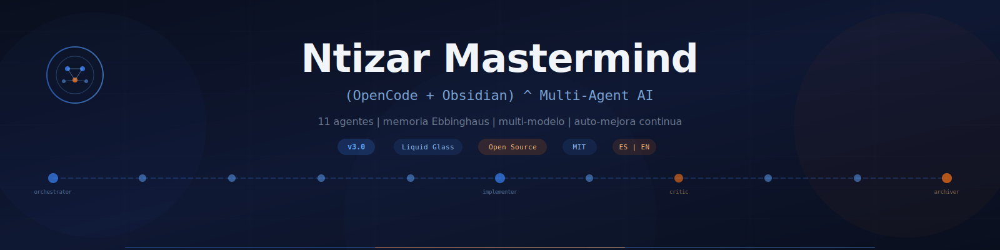

<p align="center">
  
</p>

<h1 align="center">(OpenCode + Obsidian) ^ Ntizar Mastermind</h1>

<p align="center">
  <strong>A multi-agent AI orchestration system that actually remembers, learns, and forgets.</strong>
</p>

<p align="center">
  <a href="#quick-start">Quick Start</a> |
  <a href="README.md">Espanol (principal)</a> |
  <a href="docs/ARCHITECTURE.md">Architecture</a> |
  <a href="#learning-platform">Learning Platform</a> |
  <a href="#roadmap">Roadmap</a>
</p>

<p align="center">
  
  
  
  
  
</p>

---

## The Problem

You use AI every day. You copy-paste context. You re-explain your project. You lose learnings between sessions. Your prompts are long, expensive, and fragile.

**What if your AI had a brain?**

Not a chatbot. Not a single prompt. A structured, multi-agent system with persistent memory, specialized roles, and a forgetting curve that keeps your context lean and relevant.

## What Is Ntizar Mastermind?

Ntizar Mastermind is an **open-source multi-agent orchestration framework** that runs on [OpenCode](https://opencode.ai) + [Obsidian](https://obsidian.md). It transforms your AI workflow from "one conversation at a time" into a **persistent, self-improving intelligence system**.

### How It Works

```
You give a task
    |
    v
ORCHESTRATOR classifies it (type, complexity, domain)
    |
    v
Selects the optimal FLOW (3 to 10 agents)
    |
    v
Each AGENT runs on the best model for its role
    |
    v
Results are REVIEWED, CRITICIZED, and SYNTHESIZED
    |
    v
Learnings are ARCHIVED with an expiry curve
    |
    v
Next session starts smarter, not from zero
```

### Key Differentiators

| Feature | Traditional Prompting | Ntizar Mastermind v3 |
|---------|----------------------|---------------------|
| Context | Lost every session | Persistent memory with intelligent decay |
| Agents | Single personality | 11 specialized agents with defined roles |
| Models | One model does everything | Each agent runs on its optimal model |
| Cost | Full context every time | 40-60% token savings via smart loading |
| Quality | No review process | Mandatory review + adversarial critic |
| Learning | Starts from zero | Accumulates patterns, skills, and project knowledge |
| Control | AI decides everything | Human-in-the-loop at every critical checkpoint |

---

## The 11 Agents

The system operates as a **pipeline** where each agent has a single responsibility:

| # | Agent | Role | Think of it as... |
|---|-------|------|-------------------|
| 00 | **Orchestrator** | Classifies tasks, designs flows, delegates | The CEO |
| 01 | **Classifier** | Evaluates complexity, domain, ambiguity | The Triage Nurse |
| 02 | **Explorer** | Reads context without modifying anything | The Scout |
| 03 | **Planner** | Defines strategy, steps, success criteria | The Architect |
| 04 | **Spec Writer** | Converts plan into unambiguous executable spec | The Contract Lawyer |
| 05 | **Implementer** | Executes the spec, produces deliverables | The Builder |
| 06 | **Reviewer** | PASS/FAIL validation against spec criteria | The QA Inspector |
| 07 | **Critic** | Adversarial review -- finds what others miss | The Devil's Advocate |
| 08 | **Synthesizer** | Transforms reports into human-readable results | The Translator |
| 09 | **Archiver** | Distills learnings with decay metadata | The Librarian |
| 10 | **Librarian** | Maintains the knowledge graph and system health | The Groundskeeper |

**The Critic never degrades.** If the best model isn't available, the Critic is omitted entirely rather than running on a weaker model. Quality over quantity.

---

## Multi-Model Architecture

Not every task needs the most expensive model. Mastermind assigns each agent the right model for its job:

```
Orchestrator + Critic  -->  Claude Opus / GPT-4o     (high reasoning)
Explorer               -->  Gemini 2.5 Pro           (1M token context)
Implementer            -->  Claude Opus / Sonnet      (code generation)
Reviewer               -->  Claude Sonnet / Flash     (concrete criteria)
Synthesizer + Archiver -->  Claude Haiku / Flash      (mechanical tasks)
```

**Result:** Same quality output, 40-60% lower cost. You choose the models -- the system proposes, you confirm.

---

## Memory That Forgets (On Purpose)

Every learning captured by the system has a **decay type** based on the Ebbinghaus forgetting curve:

```
R(t) = a / (log(t+1))^b + c
```

| Decay Type | After 30 days | After 90 days | After 180 days | Used For |
|-----------|---------------|---------------|----------------|----------|
| **Permanent** | 100% | 100% | 100% | System rules, fundamental patterns |
| **Slow** | 71% | 58% | 48% | Reusable technical patterns |
| **Normal** | 52% | 37% | 29% | Specific problem solutions |
| **Fast** | 30% | 18% | 12% | One-time fixes, temporal context |

**Why?** Because loading 200 learnings into every session is expensive and noisy. The system only loads learnings that are **relevant to the current task** AND **haven't decayed below threshold**. Old, irrelevant knowledge naturally fades. Critical patterns persist forever.

---

## Two-Layer Architecture (v3 Innovation)

The system lives in two synchronized layers with **zero duplication**:

```
agents/                    .opencode/agents/
(Obsidian - Documentation)     (OpenCode - Execution)
 |                              |
 |  Rich context, wikilinks,   |  Minimal YAML config,
 |  mission statements,        |  operational instructions,
 |  interconnections            |  model assignments
 |                              |
 +--- Source of truth           +--- Runtime engine
      (human-readable)              (machine-executable)
```

The `.opencode/` files reference Obsidian docs for full context. The Obsidian files reference `.opencode/` files for traceability. **42% reduction** in executable layer content vs v2, with zero loss of functionality.

---

## Design System: Liquid Glass UI

The project includes a **complete design system** at `design-system/ntizar.css` (1,379 lines) defining the visual identity of the entire Ntizar ecosystem:

- **Palette:** Primary blue (`#3b82f6`) + Accent orange (`#f97316`) on dark background (`#0a0f1e`)
- **Signature effect:** Liquid glass with refraction via SVG filters (Chrome/Chromium)
- **3 glass levels:** subtle, standard, strong -- for visual hierarchy without hard borders
- **Full components:** buttons, cards, badges, inputs, navbar, modal, progress bars, tooltips
- **Layout utilities:** responsive grid, spacing, containers
- **Light mode:** complete override for light contexts
- **Animations:** fade-up, gradient shifts, hover effects with fluid transitions

Pure CSS (no preprocessor, no build step), used across the learning platform and any Ntizar ecosystem project. Visual demo available at `design-system/demo.html`.

---

## Quick Start

### Prerequisites

- [Obsidian](https://obsidian.md) (free)
- [OpenCode](https://opencode.ai) (CLI tool for AI-powered development)
- At least one AI model API key (Claude, GPT-4, Gemini, etc.)

### Installation

```bash
# 1. Clone the repository
git clone https://github.com/Ntizar/ntizar-mastermind.git

# 2. Open the folder as an Obsidian vault
#    (File > Open Vault > Open folder as vault)

# 3. Configure your model API keys in OpenCode
#    (see OpenCode docs for setup)

# 4. Verify the installation
./verify-system.bat    # Windows
# or manually check: 11 agents, 4 commands, all directories exist

# 5. Start the system
opencode
# Then run: /ntizar-start
```

### First Task

Once the system boots, just give it a task:

```
"Create a landing page for my portfolio with dark mode support"
```

The orchestrator will:
1. Classify it (web development, medium complexity)
2. Propose a flow and model allocation
3. Wait for your confirmation
4. Execute the full pipeline
5. Archive what it learned

---

## Project Structure

```
ntizar-mastermind/
|
|-- AGENTS.md                    # System entry point
|-- verify-system.bat            # Installation verifier
|
|-- agents/                      # DOCUMENTATION LAYER (Obsidian)
|   |-- 00-orchestrator.md       # ... through 10-librarian.md
|   |-- session-prompt.md        # Manual activation prompt
|   |-- state/                   # System config + session state
|   |-- templates/               # Task intake, specs, reviews, projects, learnings
|   |-- skills/                  # Domain-specific knowledge (4 active)
|   |-- learnings/               # Captured patterns with decay metadata
|   |-- projects/                # Project hubs + knowledge clusters
|
|-- .opencode/                   # EXECUTION LAYER (OpenCode runtime)
|   |-- agents/                  # Agent configs (YAML + minimal instructions)
|   |-- commands/                # Slash commands (/ntizar-start, etc.)
|
|-- learning-platform/           # Brain Academy — interactive learning platform
|-- design-system/               # Liquid Glass CSS framework (1,379 lines)
|-- docs/                        # Extended documentation
```

---

## Skills System

Skills are **domain-specific playbooks** that agents load when relevant:

| Skill | Domain | What It Adds |
|-------|--------|-------------|
| `software-dev` | Universal software development | 6 mandatory phases, decision matrix, coding rules |
| `dashboard-dev` | Data visualization | 6-phase pipeline, dynamic re-learning from past projects |
| `web-deploy` | Apache shared hosting | Single-source propagation pattern, deployment checklists |
| `pwa-android` | PWA to Android APK | Complete stack: icons, PWABuilder, binary verification |

Skills are loaded **on-demand** -- only when the classifier detects a matching domain. You can create your own using the included template.

---

## Learning Platform

> **Brain Academy v3.0** — Complete and operational

A web-based interactive platform that teaches anyone how to build and use the Ntizar Mastermind system. Designed for **2 profiles** — with and without programming experience — featuring adaptive content, a disruptive tone, and real gamification.

**Live:** [ntizar-brain-learning.vercel.app](https://ntizar-brain-learning.vercel.app)

Features:
- 6 interactive modules (M0-M5) with narrative, disruptive content
- 2 profiles: "With experience" (~1h 30min) and "Without experience" (~2h 30min)
- Functional quizzes with immediate feedback
- Gamification: XP, badges, confetti, notifications
- State persistence (progress saved in localStorage)
- PDF guide generation with Ntizar design (4 pages, dark theme)
- Liquid Glass UI interface with premium animations
- Personalized content using the user's name

---

## Roadmap

### Current: v3.0 (March 2026)
- [x] Two-layer architecture (Obsidian + OpenCode)
- [x] 11 specialized agents with single-responsibility
- [x] Multi-model allocation per agent
- [x] Ebbinghaus memory decay system
- [x] 4 domain skills
- [x] 32+ learnings indexed
- [x] Portable installation with verification
- [x] Learning platform Brain Academy v3.0 (complete)
- [x] Liquid Glass CSS Design System (1,379 lines)

### Next: v3.1 -- MCP Multi-Agent Optimization
- [ ] **Native MCP server integration** -- agents communicate via Model Context Protocol instead of Task tool delegation, enabling true parallel execution
- [ ] **Token budget system** -- each agent declares token cost upfront; orchestrator optimizes allocation within a session budget
- [ ] **Streaming agent handoffs** -- agents pass partial results to the next in the pipeline without waiting for full completion
- [ ] **Agent result caching** -- identical sub-tasks across sessions reuse cached outputs (with decay-aware invalidation)
- [ ] **Dynamic flow rewriting** -- orchestrator can modify the pipeline mid-execution based on intermediate results

### Future: v4.0 -- Collaborative Intelligence
- [ ] **Multi-user knowledge sharing** -- teams share learnings across vaults with conflict resolution
- [ ] **Skill marketplace** -- community-contributed domain skills (like Obsidian plugins)
- [ ] **Cross-project pattern detection** -- the system identifies patterns across all your projects automatically
- [ ] **Visual flow editor** -- design agent pipelines visually in Obsidian
- [ ] **Benchmark suite** -- measure system performance across standardized task sets
- [ ] **Learning platform as onboarding engine** -- new team members learn the system through interactive guided tours

### Vision

The end goal is a system where:
1. **Your AI gets better every day** -- not just within a session, but across months of accumulated knowledge
2. **Cost decreases as quality increases** -- smarter routing means fewer wasted tokens
3. **Anyone can replicate it** -- the learning platform + this repo = full knowledge transfer
4. **The community improves it** -- open skills, open learnings, open patterns

---

## Contributing

We welcome contributions. See [CONTRIBUTING.md](CONTRIBUTING.md) for guidelines.

Areas where we need help:
- **New skills** -- domain-specific playbooks for your area of expertise
- **Agent optimizations** -- better prompts, smarter flows
- **Learning platform** -- content, translations, accessibility
- **MCP integration** -- the v3.1 multi-agent protocol work
- **Documentation** -- tutorials, guides, videos
- **Testing** -- benchmark tasks and quality metrics

---

## The 12 Rules

These rules were distilled from 13 cycles of real-world usage and system evolution:

1. **Complete flow mandatory** -- no agent is skipped
2. **Multi-file sync** -- propagate changes to all affected files
3. **Verify binary integrity** -- check magic bytes, not just file extensions
4. **Platform-aware deployment** -- know your hosting constraints
5. **README updated with every version** -- always current
6. **Human decides architecture** -- AI proposes, human disposes
7. **Dynamic clusters** -- knowledge categories grow organically
8. **On-demand loading** -- learnings loaded by relevance + decay, never all at once
9. **Minimum capability documented** -- each agent has a floor
10. **Critic: omit, never degrade** -- quality is non-negotiable
11. **Verify live before delivering** -- always confirm deployment works
12. **Model allocation is collaborative** -- system proposes, human confirms

---

## License

MIT License. See [LICENSE](LICENSE).

---

## Why "Mastermind"?

Because a mastermind isn't a single genius -- it's a group of specialized minds working together toward a common goal. That's exactly what this system does: 11 agents, each brilliant at one thing, orchestrated to solve problems no single prompt could handle.

---

<p align="center">
  Built with obsession by <a href="https://github.com/Ntizar">@Ntizar</a>
  <br/>
  <sub>If this system saves you time, pass it along.</sub>
</p>
