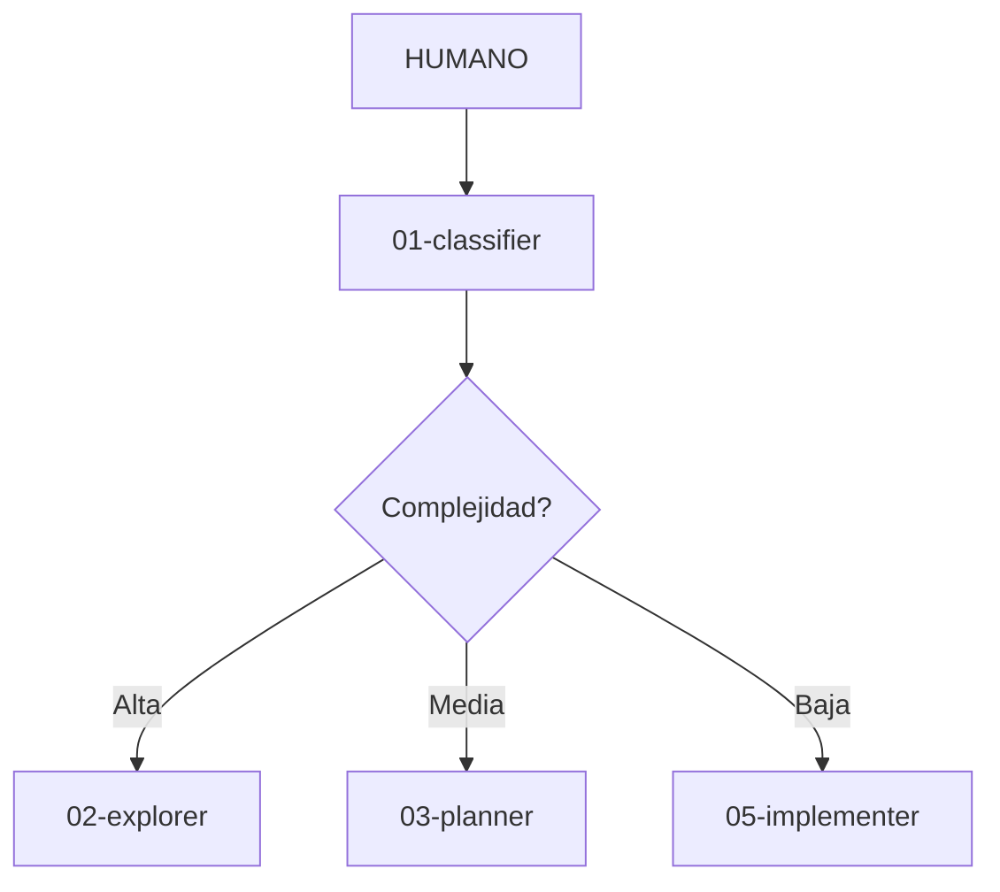

# FASE 3 — Roadmap Completo

## Visión
Transformar la plataforma de "solo contenido" a **experiencia interactiva completa** con sandbox, diagramas animados y analytics.

---

## 📅 FASE 3 — Mejoras Avanzadas

### 3.1 Sandbox Integrado (Semana 1)
**Objetivo:** Simular OpenCode en la plataforma para que usuarios prueben sin instalar nada.

#### Características:
- [ ] Chat interface que simula ser OpenCode
- [ ] Respuestas predefinidas para tareas comunes
- [ ] Mostrar flujo de agentes en tiempo real
- [ ] Output simulado de cada agente
- [ ] Botón "Probar en tu vault" al final

#### Ejemplo de uso:
```
Usuario: "Crea un SOP para onboarding de clientes"
Sandbox: 
  🔀 DELEGANDO A: classifier
  → Tipo: escritura + operaciones
  🔀 DELEGANDO A: planner
  → Pasos: 1. Recopilar info, 2. Crear template...
  [Muestra output completo]
```

**Criterios de aceptación:**
- Usuario puede escribir tarea y recibir respuesta simulada
- Se ven los agentes trabajando (animación)
- Output es realista (basado en ejemplos reales)

---

### 3.2 Diagramas Mermaid.js Animados (Semana 2)
**Objetivo:** Reemplazar diagramas estáticos con Mermaid.js que se animan al explicar el flujo.

#### Diagramas a crear:
- [ ] M1: Flujo completo de agentes (graph TD)
- [ ] M2: Jerarquía de agentes (organizational chart)
- [ ] M3: Grafo de memoria (learnings → clusters → projects)
- [ ] M5: Timeline del ciclo (sequence diagram)
- [ ] M6: Flowchart de decisión (classifier decisions)

#### Ejemplo Mermaid:


**Criterios de aceptación:**
- Diagramas se renderizan en la plataforma
- Animación al hacer scroll (reveal on scroll)
- Click en nodo → muestra detalles del agente

---

### 3.3 Analytics Básico (Semana 3)
**Objetivo:** Entender cómo usan la plataforma para mejorar contenido.

#### Eventos a trackear:
- [ ] Módulo completado
- [ ] Quiz respondido (correcto/incorrecto)
- [ ] Badge desbloqueado
- [ ] Tiempo en cada módulo
- [ ] PDF exportado
- [ ] Sandbox usado
- [ ] Punto de abandono (cuándo cierran)

#### Implementación:
- Opción A: LocalStorage (sin backend, solo para usuario)
- Opción B: Plausible Analytics (privado, sin cookies)
- Opción C: Custom endpoint (Vercel Function + Supabase)

**Recomendación:** Empezar con Opción A + export JSON para análisis manual.

**Criterios de aceptación:**
- Eventos se guardan en localStorage
- Función `exportAnalytics()` para descargar datos
- Dashboard simple en consola

---

### 3.4 Modo "Demo Guiada" (Semana 4)
**Objetivo:** Tour interactivo que guía al usuario paso a paso.

#### Características:
- [ ] Overlay que resalta elementos (intro.js o custom)
- [ ] 8 pasos (uno por módulo)
- [ ] Botones "Siguiente" y "Saltar tour"
- [ ] Progreso del tour (1/8, 2/8...)
- [ ] Se puede repetir desde configuración

**Criterios de aceptación:**
- Tour se activa automáticamente en primera visita
- Usuario puede saltar y retomar después
- Cada paso explica concepto clave

---

### 3.5 Comparador "Antes/Después" (Semana 5)
**Objetivo:** Mostrar el valor del sistema comparando trabajo con/sin agentes.

#### Ejemplo:
```
┌─────────────────┬──────────────────┬──────────────────┐
│ Tarea           │ Sin Sistema      │ Con {{NAME}}     │
├─────────────────┼──────────────────┼──────────────────┤
│ Crear SOP       │ 2 horas          │ 20 minutos       │
│ Analizar CSV    │ 3 horas          │ 30 minutos       │
│ Landing page    │ 1 día            │ 1 hora           │
└─────────────────┴──────────────────┴──────────────────┘
```

**Criterios de aceptación:**
- Tabla comparativa en M0 o M1
- Datos realistas (basados en casos reales)
- CTA claro: "Empieza ahora"

---

### 3.6 Sistema de "Misiones Diarias" (Semana 6)
**Objetivo:** Gamificación avanzada para mantener engagement.

#### Características:
- [ ] 3 misiones diarias (ej: "Completa M2", "Quiz 100%")
- [ ] XP bonus por misiones (50-100 XP)
- [ ] Racha diaria (streak counter)
- [ ] Recompensas por racha (7 días = badge especial)
- [ ] Reset diario a medianoche

**Criterios de aceptación:**
- Misiones se generan automáticamente
- Streak se guarda en localStorage
- Notificación visual cuando hay misiones pendientes

---

## 🛠️ Stack Técnico FASE 3

| Feature | Librería | CDN | Size |
|---------|----------|-----|------|
| Mermaid.js | mermaid@10 | ✅ | ~70KB |
| Intro.js | intro.js | ✅ | ~25KB |
| Chart.js | chart.js | ✅ | ~60KB |
| Analytics | Plausible | ✅ | ~1KB |

**Total añadido:** ~156KB (acceptable, bajo 200KB)

---

## 📊 Métricas de Éxito FASE 3

| Métrica | FASE 2 | FASE 3 Objetivo |
|---------|--------|-----------------|
| Completion rate | ~40% | 65% |
| Tiempo promedio | 120min | 75min |
| Sandbox usage | 0% | 40% |
| Demo completion | 0% | 60% |
| Return visitors | N/A | 25% |

---

## 📋 Tareas Inmediatas (Semana 1)

### Día 1-2: Sandbox UI
- [ ] Crear `sandbox.html` con chat interface
- [ ] Diseñar bubbles de conversación (usuario/sistema)
- [ ] Añadir input field y botón enviar

### Día 3-4: Sandbox Logic
- [ ] Crear `sandbox-responses.json` con 20+ respuestas predefinidas
- [ ] Implementar match de keywords → respuesta
- [ ] Añadir delays para simular "thinking"

### Día 5-7: Agentes Simulados
- [ ] Animación de agentes trabajando
- [ ] Output simulado para cada tipo de tarea
- [ ] Botón "Probar en tu vault" al final

**Criterio de aceptación:** Usuario puede escribir "Crea un SOP" y recibir respuesta simulada completa.

---

*Roadmap creado: 2026-03-25*
*Última actualización: 2026-03-25*
*Versión: 3.0-draft*
