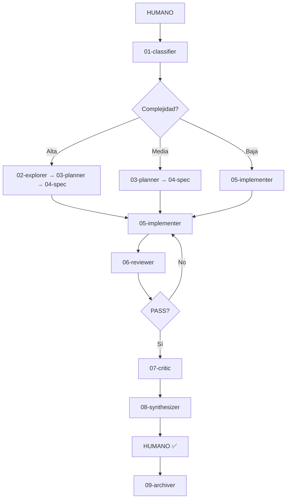

# Proyecto: Learning Platform v2

## Estado
✅ **Activa — En desarrollo FASE 3**

## URL
https://learning-platform-roan-six.vercel.app (versión Vercel)
Local: `learning-platform/start.bat` → http://localhost:8000

## Descripción
Plataforma educativa para aprender a montar y usar el sistema de agentes ({{NAME}} Brain) sobre Obsidian. Enfocada en usuarios NO TÉCNICOS que quieren replicar el sistema fácilmente.

**Modelo:** Pago único (una vez completada)
**Promesa:** En 2 horas tienes tu sistema operativo de inteligencia funcionando

## Arquitectura Actual (v2)

### Archivos Principales
| Archivo | Propósito | Líneas |
|---------|-----------|--------|
| `index.html` | Estructura HTML con 5 pantallas | ~180 |
| `platform-v2.js` | Motor con perfiles, gamificación, PDF | ~630 |
| `modules-v2.json` | Contenido M0-M5 con placeholders | ~500 |
| `profiles.json` | 5 perfiles (no-programador, junior-dev, consultor, equipo, estudiante) | ~150 |
| `ntizar.css` | Estilos + liquid glass + responsive | ~1400 |
| `platform.css` | Estilos específicos plataforma | ~300 |
| `start.bat` | Testing local con auto-open navegador | ~80 |

### Archivos Secundarios
| Archivo | Propósito |
|---------|-----------|
| `sandbox.html` | Sandbox simulador (OCULTO - consume tokens) |
| `sandbox.js` | Lógica sandbox |
| `mermaid.css` | Estilos para diagramas Mermaid (en desarrollo) |

## Módulos (M0-M8)

### Completados (FASE 1-2)
| Módulo | Contenido | Estado |
|--------|-----------|--------|
| M0 | Bienvenida + selección perfil | ✅ |
| M1 | Arquitectura + diagrama Mermaid (parcial) | ✅ |
| M2 | Los 10 agentes (11 cards interactivas) | ✅ |
| M3 | Memoria (Skills, Learnings, Clusters) | ✅ |
| M4 | Setup en 10 minutos | ✅ |
| M5 | Tu primer ciclo completo | ✅ |
| M6 | Tu primer proyecto real (ejemplos por perfil) | ✅ |
| M7 | 12 ejemplos prácticos (3×4 perfiles) | ✅ |
| M8 | Replicar el sistema (plantillas skill/learning) | ✅ |

### Features Implementadas
- [x] Sistema de perfiles (5 perfiles con vocabulario, ejemplos, duración)
- [x] Personalización dinámica (15+ placeholders reemplazados)
- [x] Gamificación (XP, 5 niveles, 7 badges)
- [x] PDF export (guía 1 página con tips por perfil)
- [x] Liquid glass effects (glass-refract, animación liquid)
- [x] Responsive design (768px, 480px)
- [x] Start.bat (check de archivos + auto-open)
- [x] Sandbox simulador (OCULTO)

## Learnings del Proyecto

### FASE 1 — Fundamentos
1. [[2026-03-25-learning-platform-v2-planificacion-ordenada]] — Planificación ordenada con límites de contexto
2. [[2026-03-25-profiles-json-5-perfiles]] — Sistema de 5 perfiles de usuario
3. [[2026-03-25-modules-json-estructura-perfiles]] — Estructura de módulos con personalización
4. [[2026-03-25-modules-v2-placeholders-personalizacion]] — Placeholders para personalización dinámica
5. [[2026-03-25-platform-v2-js-perfiles-gamificacion]] — Platform.js con perfiles y gamificación
6. [[2026-03-25-modules-v2-contenido-completo-enriquecido]] — Contenido completo enriquecido
7. [[2026-03-25-start-bat-v2-browser-auto]] — Start.bat con apertura automática
8. [[2026-03-25-platform-v2-simplificado-robusto]] — Platform.js simplificado y robusto
9. [[2026-03-25-pdf-export-guia-instalacion]] — PDF export con guía de instalación
10. [[2026-03-25-gamificacion-badges-y-pdf]] — Gamificación con badges y PDF
11. [[2026-03-25-fase-1-perfiles-gamificacion-completa]] — FASE 1 completa
12. [[2026-03-25-liquid-glass-effects-visual]] — Efectos liquid glass para visual impact
13. [[2026-03-25-contenido-calidad-m1-m2-mejorado]] — Contenido de calidad M1-M2

### FASE 2 — Contenido por Perfiles
14. [[2026-03-25-modulos-m6-m8-contenido-perfiles]] — M6-M8 con proyectos por perfil
15. [[2026-03-25-modules-v2-contenido-completo-enriquecido]] — Modules-v2.json completo
16. [[2026-03-25-fase-2-contenido-perfiles-completa]] — FASE 2 completa

### FASE 3 — En Desarrollo
17. [[2026-03-25-fase-3-roadmap-creado]] — Roadmap FASE 3 (6 semanas)
18. [[2026-03-25-sandbox-integrado-semana-1]] — Sandbox integrado
19. [[2026-03-25-fase-3-semana-1-sandbox-archivado]] — Sandbox archivado (consume tokens)

### Lecciones Principales
20. [[2026-03-25-leccion-trabajar-ordenado-por-partes]] — Trabajar ordenado por partes da ventaja competitiva

## Clusters
#web #github #sistema

---

## 📋 FASE 3 — Roadmap Completo (Para Retomar)

### Estado Actual
- ✅ Semana 1: Sandbox (completado pero archivado)
- ⏳ Semana 2: Mermaid.js diagrams animados
- ⏳ Semana 3: Analytics básico
- ⏳ Semana 4: Demo guiada (intro.js)
- ⏳ Semana 5: Comparador antes/después
- ⏳ Semana 6: Misiones diarias

### Tareas Inmediatas (Semana 2)

#### Mermaid.js Diagrams
- [ ] Añadir `<script src="mermaid.min.js">` en index.html (ya hecho parcial)
- [ ] Incluir `mermaid.css` en estilos
- [ ] Inicializar Mermaid en platform-v2.js con `mermaid.init()`
- [ ] Reemplazar diagramas estáticos M1-M2 con Mermaid
- [ ] Añadir animación reveal-on-scroll

#### Ejemplo Mermaid para M1:


### Tareas Semana 3 — Analytics
- [ ] Crear `analytics.js` con tracking de eventos
- [ ] Trackear: módulo completado, quiz respondido, badge, PDF exportado
- [ ] Guardar en localStorage
- [ ] Función `exportAnalytics()` para descargar JSON

### Tareas Semana 4 — Demo Guiada
- [ ] Añadir `<script src="intro.js">` en index.html
- [ ] Crear `demo-steps.json` con 8 pasos
- [ ] Activar automáticamente en primera visita
- [ ] Botón para repetir desde configuración

### Tareas Semana 5 — Comparador A/B
- [ ] Añadir tabla comparativa en M0 o M1
- [ ] Mostrar: tiempo sin sistema vs con sistema
- [ ] Ejemplos reales de ahorro de tiempo

### Tareas Semana 6 — Misiones Diarias
- [ ] Crear `missions.js` con generación de misiones
- [ ] 3 misiones diarias aleatorias
- [ ] XP bonus por completar misiones
- [ ] Streak counter con badges por racha

---

## 🔧 Para Retomar (En 2 Semanas)

### Paso 1: Lee el Índice
```bash
# Abre Obsidian y lee:
agents/learnings/_index.md
```
Te dirá qué learnings cargar según la tarea actual.

### Paso 2: Carga Learnings Relevantes
Solo los que el índice indica como "siempre en proyectos de plataformas educativas":
- [[2026-03-25-fase-3-roadmap-creado]] — Roadmap completo FASE 3
- [[2026-03-25-leccion-trabajar-ordenado-por-partes]] — Patrón de trabajo

### Paso 3: Ejecuta Semana 2
1. Lee `agents/projects/learning-platform.md` (este archivo)
2. Ve a sección "Tareas Inmediatas (Semana 2)"
3. Sigue el checklist
4. Archiva cada learning después de completar

### Paso 4: Sigue el Patrón
1. Micro-tarea <15min
2. Archiva learning
3. Actualiza _index.md
4. Siguiente micro-tarea

**Ventaja competitiva:** Tu memoria está en Obsidian, no en tu cabeza. El sistema te dice qué hacer.

---

## 📊 Métricas Actuales

| Métrica | FASE 1 | FASE 2 | FASE 3 |
|---------|--------|--------|--------|
| Módulos | M0-M5 | M6-M8 | - |
| Ejemplos | 0 | 12 | 0 |
| Quizzes | 14 | 4 | 0 |
| Líneas código | ~950 | ~780 | ~350 |
| Learnings | 13 | 3 | 3 |

---

*Hub creado: 2026-03-25*
*Última actualización: 2026-03-25*
*Próxima sesión: En 2 semanas*
*Estado: Archivado para retomar*
